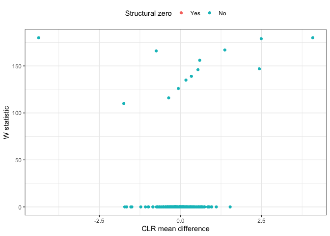

# User Manual for [ANCOM](https://www.tandfonline.com/doi/full/10.3402/mehd.v26.27663) v2.1

[](https://github.com/xec-cm/ANCOM/actions)
[](https://doi.org/10.5281/zenodo.3577802)

The current code implements ANCOM in cross-sectional and longitudinal
datasets while allowing the use of covariates.

## Installation

To get a bug fix or to use a feature from the development version, you
can install the development version of ANCOM from GitHub.

``` r
if(!requireNamespace("devtools")){
  install.packages("devtools")
}

devtools::install_github("xec-cm/ANCOM")
```

## Usage

``` r
library(ANCOM)

# Step 0: Load or define input data

feature_table <- ANCOM:::moving_pics_table_taxa
meta_data <- ANCOM:::moving_pics_sample_metadata

# Step 1: Data Preprocessing

prepro <- feature_table_pre_process(
  feature_table = feature_table,
  meta_data = meta_data,
  sample_var = "Sample.ID",
  group_var = NULL,
  out_cut = 0.05,
  zero_cut = 0.90,
  lib_cut = 1000,
  neg_lb = FALSE
)

# Step 2: ANCOM

res <- ANCOM(
  feature_table = prepro$feature_table, 
  meta_data = prepro$meta_data,
  struc_zero = prepro$structure_zeros, 
  main_var = "Subject", 
  p_adj_method = "BH", 
  alpha = 0.05, 
  adj_formula = NULL, 
  rand_formula = NULL
)

head(res)
```

    ## $out
    ##                              taxa_id   W detected_0.9 detected_0.8 detected_0.7
    ## 1   4b5eeb300368260019c1fbc7a3c718fc 180         TRUE         TRUE         TRUE
    ## 2   fe30ff0f71a38a39cf1717ec2be3a2fc   0        FALSE        FALSE        FALSE
    ## 3   868528ca947bc57b69ffdf83e6b73bae 180         TRUE         TRUE         TRUE
    ## 4   154709e160e8cada6bfb21115acc80f5   0        FALSE        FALSE        FALSE
    ## 5   1d2e5f3444ca750c85302ceee2473331   0        FALSE        FALSE        FALSE
    ## 6   0305a4993ecf2d8ef4149fdfc7592603   0        FALSE        FALSE        FALSE
    ## 7   cb2fe0146e2fbcb101050edb996a0ee2   0        FALSE        FALSE        FALSE
    ## 8   997056ba80681bbbdd5d09aa591eadc0   0        FALSE        FALSE        FALSE
    ## 9   bfbed36e63b69fec4627424163d20118   0        FALSE        FALSE        FALSE
    ## 10  90d32ffe026535b392c0bad850f213c4   0        FALSE        FALSE        FALSE
    ## 11  d86ef5d6394f5dbeb945f39aa25e7426   0        FALSE        FALSE        FALSE
    ## 12  cdd14cce4ec44b3235923652b71e947e 179         TRUE         TRUE         TRUE
    ## 13  b44621e5c80607cdfacbf7a81e1cbe41   0        FALSE        FALSE        FALSE
    ## 14  535696cecf56f03d3401d7d6dbe66d7b   0        FALSE        FALSE        FALSE
    ## 15  44ff26d8105cf822417b4b0c4eb27c02   0        FALSE        FALSE        FALSE
    ## 16  ab6b063ed43d8cb3008e157a0a305c47 147        FALSE         TRUE         TRUE
    ## 17  fcd4f95c05b868060121ff709085bf21   0        FALSE        FALSE        FALSE
    ## 18  57b34afdff2e84fb9b0befd219edcb38   0        FALSE        FALSE        FALSE
    ## 19  047b7fb62a5e9d2711e639ae1cb1519a   0        FALSE        FALSE        FALSE
    ## 20  0160e14a78b18b903618f11bc732746e 110        FALSE        FALSE        FALSE
    ## 21  d2613a43f4ed1dda8a673e7fb251ebef   0        FALSE        FALSE        FALSE
    ## 22  e7c8b8c8fced8eead4b767bffe6dd544   0        FALSE        FALSE        FALSE
    ## 23  7dd9c9124ec3f118a6cef1f0d422c011   0        FALSE        FALSE        FALSE
    ## 24  01e0b7ac306895be84179f2715af269b   0        FALSE        FALSE        FALSE
    ## 25  ee0fb26fca3afb05e0b288d6fcab899e   0        FALSE        FALSE        FALSE
    ## 26  0a69950e803a5d9e7166c450e44f43cf   0        FALSE        FALSE        FALSE
    ## 27  79e9e337b10e2d298bb1b3bde946782d   0        FALSE        FALSE        FALSE
    ## 28  9118606a87ac19f8d041da20f16f3236 167         TRUE         TRUE         TRUE
    ## 29  41fedaa9200e2933821f84ecdc0b0772   0        FALSE        FALSE        FALSE
    ## 30  b8afb7bb30b7a9170b7c6dcd40251d54   0        FALSE        FALSE        FALSE
    ## 31  3ef461f213bfc675ddf0b1bfeef2dc52   0        FALSE        FALSE        FALSE
    ## 32  b3d4d129c955517b446df657236ba5a2 166         TRUE         TRUE         TRUE
    ## 33  fc15824cd9e9c29e1319d32843452b54   0        FALSE        FALSE        FALSE
    ## 34  f8f937eeee7762f446a0e87292f98eb6   0        FALSE        FALSE        FALSE
    ## 35  052128d7d424728578efe7852b0afd0d   0        FALSE        FALSE        FALSE
    ## 36  e063d1c3c9daf7390e5475e48d9b01c5   0        FALSE        FALSE        FALSE
    ## 37  2e55763e77234a7bfc3a311067a0c7e1   0        FALSE        FALSE        FALSE
    ## 38  3ae3e825c5e3862af6c17798e2b40a37   0        FALSE        FALSE        FALSE
    ## 39  880968796af86b3d6270c228fe8e7026 146        FALSE         TRUE         TRUE
    ## 40  26133b4163fdcd22d86f4e04e74154f1   0        FALSE        FALSE        FALSE
    ## 41  29a92aecac56c855cbfc0debf9bda0c8   0        FALSE        FALSE        FALSE
    ## 42  7a5d5e6f85da7ca91daa2d803e8f9279 156        FALSE         TRUE         TRUE
    ## 43  acfe4c003905a7074aeaf385b78ad9e0   0        FALSE        FALSE        FALSE
    ## 44  f59a4d48a03cc224462bf83e4d4ab126   0        FALSE        FALSE        FALSE
    ## 45  d781fa7e866ac295ce9a56bd97912983 139        FALSE        FALSE         TRUE
    ## 46  f91c81859bf6eede55eef9c915dd8bab   0        FALSE        FALSE        FALSE
    ## 47  a5551fc60aa8bbaab737487552ea2a75   0        FALSE        FALSE        FALSE
    ## 48  a4c08e2c3a34038ea877b16d01736837   0        FALSE        FALSE        FALSE
    ## 49  21a0198d0a83a8f3ec0e401067138940   0        FALSE        FALSE        FALSE
    ## 50  393e6e2cbe258ed27a4ca0a2ee0d2cdc   0        FALSE        FALSE        FALSE
    ## 51  f16a387e898dbae6432b2ed0241120bd   0        FALSE        FALSE        FALSE
    ## 52  b383ade799e9c83c649cec37705a251d 135        FALSE        FALSE         TRUE
    ## 53  1d17561d16d803f652b0d6bdd671c1cc   0        FALSE        FALSE        FALSE
    ## 54  3bf2fc236887eda11c969b84d30f9fbf   0        FALSE        FALSE        FALSE
    ## 55  30faafef155964edd9db9374f36c45bf   0        FALSE        FALSE        FALSE
    ## 56  ff3df50eea7490dd794148649c480fd3   0        FALSE        FALSE        FALSE
    ## 57  3982159c2603cacc4bc4893003bda323   0        FALSE        FALSE        FALSE
    ## 58  846cbaf603b77be035fe0cb61d14a23c   0        FALSE        FALSE        FALSE
    ## 59  a5df9a825c3d8eeb228a6781c3db134c   0        FALSE        FALSE        FALSE
    ## 60  145f11599b92ad3a4c93896b0edf8c0c   0        FALSE        FALSE        FALSE
    ## 61  87899779aec8d38dfaf48d895cfe8021   0        FALSE        FALSE        FALSE
    ## 62  d3e265209c342d15d93a910e38ad9be2 126        FALSE        FALSE         TRUE
    ## 63  fb4f7d9d3f91ac2f22a542fbd13019c1   0        FALSE        FALSE        FALSE
    ## 64  ed950935b660fb10449d5f229dc13fb9   0        FALSE        FALSE        FALSE
    ## 65  bb370945a6777f712cfd963c55f2ff54   0        FALSE        FALSE        FALSE
    ## 66  59fefb91cc66ef6930b0201e4bf24cbb   0        FALSE        FALSE        FALSE
    ## 67  1f0a072da4906270a684a389c1586582 116        FALSE        FALSE        FALSE
    ## 68  aa668eb01ca9dcc59aeb1454b600c8c8   0        FALSE        FALSE        FALSE
    ## 69  5437cb1c86c72638cbbc12896f88d1b1   0        FALSE        FALSE        FALSE
    ## 70  cba5f5b1153235425628bd77a28257c7   0        FALSE        FALSE        FALSE
    ## 71  2fa276cce32e900f0f68d30e460b8f61   0        FALSE        FALSE        FALSE
    ## 72  91d0b3b7c0329b9a164b6e04a181f1d6   0        FALSE        FALSE        FALSE
    ## 73  84755bc954af6d3b39bb4c369e5992e7   0        FALSE        FALSE        FALSE
    ## 74  4b8228f4d7d3809aa6827e8d9e11a9ae   0        FALSE        FALSE        FALSE
    ## 75  f023384b8f989d014dd2ead7f10db307   0        FALSE        FALSE        FALSE
    ## 76  b5bf6383b53e0add0d6589b73949462a   0        FALSE        FALSE        FALSE
    ## 77  136e9f5aa470119165e59d202fdb318c   0        FALSE        FALSE        FALSE
    ## 78  465e9cab9abce306c1e0f7459b325c33   0        FALSE        FALSE        FALSE
    ## 79  77a517253ff10afeb78a37bc13d649a0   0        FALSE        FALSE        FALSE
    ## 80  fea5c05e9b8245c5ca46f6673f59e0bf   0        FALSE        FALSE        FALSE
    ## 81  ae881162d813e498f40bf33b8e42d54a   0        FALSE        FALSE        FALSE
    ## 82  32875774cffdc8c820f91d8e86f9a0e6   0        FALSE        FALSE        FALSE
    ## 83  868a4fe285b85fa1b8eb40071d5397be   0        FALSE        FALSE        FALSE
    ## 84  201b6484b6abe3d4c587464be6cbd574   0        FALSE        FALSE        FALSE
    ## 85  67f9c74eeea5a4609bd1d2fab66ad3cc   0        FALSE        FALSE        FALSE
    ## 86  0c4b17f88dae47697d3bceb3663f47ce   0        FALSE        FALSE        FALSE
    ## 87  fc1f49989e78fa71bc6404ff2a148576   0        FALSE        FALSE        FALSE
    ## 88  919764896275058362e55f0849d2b38b   0        FALSE        FALSE        FALSE
    ## 89  4b13979d719e78a50cb0eac34d72dec1   0        FALSE        FALSE        FALSE
    ## 90  b8b19c4f0719a5d5b965a0f50f05827c   0        FALSE        FALSE        FALSE
    ## 91  9e1c6b703a4312cce306c7757688a351   0        FALSE        FALSE        FALSE
    ## 92  a0b0961c7ba318abff3e5a93f09f495e   0        FALSE        FALSE        FALSE
    ## 93  24dfe6a7325e4f2be7dbd522ef613e42   0        FALSE        FALSE        FALSE
    ## 94  55937e5781c91185e27a91216008e4ca   0        FALSE        FALSE        FALSE
    ## 95  43a9c44adeac51fd3ab95081da56d02d   0        FALSE        FALSE        FALSE
    ## 96  823698689031b0b9c2c5152f92ffc70f   0        FALSE        FALSE        FALSE
    ## 97  3b65e1db6742cc44493248fff266f564   0        FALSE        FALSE        FALSE
    ## 98  b00d44992702bd3743d7f353638d42f9   0        FALSE        FALSE        FALSE
    ## 99  c04b03fdea7f81c8c52fc540c50a24a4   0        FALSE        FALSE        FALSE
    ## 100 3add7df323955b22d1cea664ef38165d   0        FALSE        FALSE        FALSE
    ## 101 a1b971c01ce0b220275c218adbe717c1   0        FALSE        FALSE        FALSE
    ## 102 66a605fcdaa020dbdd6136f241ea79d9   0        FALSE        FALSE        FALSE
    ## 103 c57b70d65a63c4bf9f12c179c2416839   0        FALSE        FALSE        FALSE
    ## 104 5df503c1ddf8f3f4ac9e49e983e3d7fd   0        FALSE        FALSE        FALSE
    ## 105 ebd1dcd162acede67bb633c42c7b2ac2   0        FALSE        FALSE        FALSE
    ## 106 80b20e907aa4fcf2309796bc303d151d   0        FALSE        FALSE        FALSE
    ## 107 7fee9350277038eef98dee70b4190563   0        FALSE        FALSE        FALSE
    ## 108 34e40677eda6fb724e9323b0835d5ab0   0        FALSE        FALSE        FALSE
    ## 109 48eda83fda558aea8fdd32b9c8dfff98   0        FALSE        FALSE        FALSE
    ## 110 0f55566622d8244073432b2e67b24baa   0        FALSE        FALSE        FALSE
    ## 111 956d0a6f5a8e1d2fbb39df909cc14894   0        FALSE        FALSE        FALSE
    ## 112 816b94bcd935ca38afe71fd1e3c5356c   0        FALSE        FALSE        FALSE
    ## 113 ee7ce85e38500b28d9d79b63c7fbf9a6   0        FALSE        FALSE        FALSE
    ## 114 8659c05e82a2d1399cbc3fd26ab938e4   0        FALSE        FALSE        FALSE
    ## 115 3677e15d86603bf0a6bb50f8b010afe7   0        FALSE        FALSE        FALSE
    ## 116 54b4964000ad1631e547c46a828ed1a0   0        FALSE        FALSE        FALSE
    ## 117 1893b0ad352ee7db0f565bc4594e6dc6   0        FALSE        FALSE        FALSE
    ## 118 2b148d88c49e316f85b6e7863089a886   0        FALSE        FALSE        FALSE
    ## 119 cbb7ea319a7633cf0917c6e5cde0e923   0        FALSE        FALSE        FALSE
    ## 120 edacf632dcadc21c328669befafe2af6   0        FALSE        FALSE        FALSE
    ## 121 e2c355360209f0b71b70b85ed0f9532d   0        FALSE        FALSE        FALSE
    ## 122 3b795f0122b28b0e6a07bec73894acee   0        FALSE        FALSE        FALSE
    ## 123 e2f0caba18b002ca9762ed56167c6188   0        FALSE        FALSE        FALSE
    ## 124 02ef9a59d6da8b642271166d3ffd1b52   0        FALSE        FALSE        FALSE
    ## 125 c7ec57695a6d83b461eba523752755ec   0        FALSE        FALSE        FALSE
    ## 126 74c2326ccd0bc2bd9e0f23f15b79ea16   0        FALSE        FALSE        FALSE
    ## 127 8f0a7d866b4e5ebf1e34d0a44eb950a4   0        FALSE        FALSE        FALSE
    ## 128 d8db52dac1023a8fa0e56e92670d7ac1   0        FALSE        FALSE        FALSE
    ## 129 51757b1a0a985640893725af5d87d350   0        FALSE        FALSE        FALSE
    ## 130 d51cd90e95b57acb614698dc580759fb   0        FALSE        FALSE        FALSE
    ## 131 b0ca0d2568c23c26c6704017eae471e1   0        FALSE        FALSE        FALSE
    ## 132 1a8d25f7529d783a219ef689701dd4e2   0        FALSE        FALSE        FALSE
    ## 133 491ef1635067f62c395bdffd58966092   0        FALSE        FALSE        FALSE
    ## 134 e80d9134b601511a2702b54268b57249   0        FALSE        FALSE        FALSE
    ## 135 3111520c8424a2a5bdd46558ae7650e8   0        FALSE        FALSE        FALSE
    ## 136 02878fe3ccc81d4c884ca5574178d6a0   0        FALSE        FALSE        FALSE
    ## 137 f4eefbd4edf2a372131825289fffcca6   0        FALSE        FALSE        FALSE
    ## 138 aee707afe3847427a6d3d34e31437923   0        FALSE        FALSE        FALSE
    ## 139 33176e81f3e7ef2b9de1b783ff1ca33c   0        FALSE        FALSE        FALSE
    ## 140 f66effc279917d65747b7c3ef8d62432   0        FALSE        FALSE        FALSE
    ## 141 160029903cd9c779390f4719179aeea2   0        FALSE        FALSE        FALSE
    ## 142 0741ae033054073fece98b9948ec4387   0        FALSE        FALSE        FALSE
    ## 143 fbf110ef5de76f86121c8504a0cb786e   0        FALSE        FALSE        FALSE
    ## 144 a841dd7e2f38b26bb7bb37179b4141d5   0        FALSE        FALSE        FALSE
    ## 145 73291cac0e802b6a1fb25ae7079390ef   0        FALSE        FALSE        FALSE
    ## 146 63145f49e7efc26729094a53d97c0cd1   0        FALSE        FALSE        FALSE
    ## 147 1ea96d595539133266a3dbd49daac1e4   0        FALSE        FALSE        FALSE
    ## 148 f95cdb71258ef6cc222c673ea4546caf   0        FALSE        FALSE        FALSE
    ## 149 1e1e0cca52fab68a8c7ba5256aeadd6d   0        FALSE        FALSE        FALSE
    ## 150 1395953fab837ed426f9b2ba24da41b1   0        FALSE        FALSE        FALSE
    ## 151 b2d056fa113334bd2797397b162c6ac9   0        FALSE        FALSE        FALSE
    ## 152 9c6b4f83513e63a49ce33a8aeb1813ad   0        FALSE        FALSE        FALSE
    ## 153 7e4d5b19d3213719048fe55dfad0da3a   0        FALSE        FALSE        FALSE
    ## 154 8c001c89f020a1b78b26ee21d1d56746   0        FALSE        FALSE        FALSE
    ## 155 6bd57e46e038faafe4bb747e1d494df7   0        FALSE        FALSE        FALSE
    ## 156 1a2d9f4af510ce624fa0337c3ea9fedc   0        FALSE        FALSE        FALSE
    ## 157 f1d63da515a0c96eb9f7af5de75655bb   0        FALSE        FALSE        FALSE
    ## 158 167baae5fe04a754df7eb073c07adaa7   0        FALSE        FALSE        FALSE
    ## 159 124e839582c0a3329101182cb28619a8   0        FALSE        FALSE        FALSE
    ## 160 51b573b10d63a2cbe455deeef5bae002   0        FALSE        FALSE        FALSE
    ## 161 6b4a0a64da52980e7a1b1a770978bb88   0        FALSE        FALSE        FALSE
    ## 162 b89da5ee2f75672a2656789aea91071d   0        FALSE        FALSE        FALSE
    ## 163 48a6cea7eaf29dcb52dc2985933f4249   0        FALSE        FALSE        FALSE
    ## 164 4e34087bb8399deb145896c92e1b58a5   0        FALSE        FALSE        FALSE
    ## 165 5beb76b0d6631d10fc820c2d128d4cb6   0        FALSE        FALSE        FALSE
    ## 166 ba3ff6e27b67596844f11db93e44c496   0        FALSE        FALSE        FALSE
    ## 167 af12fc27ee17864717830cafd06453cd   0        FALSE        FALSE        FALSE
    ## 168 1076b2b7de5233cc917c9425aa2ea200   0        FALSE        FALSE        FALSE
    ## 169 a80183c045cf890899121db3bbcbd39d   0        FALSE        FALSE        FALSE
    ## 170 6bf95d9914dc404e98ebff522496533d   0        FALSE        FALSE        FALSE
    ## 171 e7709791d7ef6b47747de9fb43880d14   0        FALSE        FALSE        FALSE
    ## 172 f908d554fc6eeb9fef7a7028fa791475   0        FALSE        FALSE        FALSE
    ## 173 e3d37109be4a17d8437f6fcb6072982d   0        FALSE        FALSE        FALSE
    ## 174 09fc3d8a98c2ca72c69b63a51b5b564e   0        FALSE        FALSE        FALSE
    ## 175 3a31937521e389cbdf89ca01039e5ec3   0        FALSE        FALSE        FALSE
    ## 176 30d793622ebd90e7687dd3827701d46e   0        FALSE        FALSE        FALSE
    ## 177 fe72a66c85df0ab333e3a37d0332df67   0        FALSE        FALSE        FALSE
    ## 178 bc15061b61cf6b5002c58284591f97d4   0        FALSE        FALSE        FALSE
    ## 179 dbae1b46b67ad6769ea63d33ed3d44bf   0        FALSE        FALSE        FALSE
    ## 180 6d7d9658988c6e2b5e45ea087f1b9155   0        FALSE        FALSE        FALSE
    ## 181 502b6544978890cda2ece2d14bfdba01   0        FALSE        FALSE        FALSE
    ##     detected_0.6
    ## 1           TRUE
    ## 2          FALSE
    ## 3           TRUE
    ## 4          FALSE
    ## 5          FALSE
    ## 6          FALSE
    ## 7          FALSE
    ## 8          FALSE
    ## 9          FALSE
    ## 10         FALSE
    ## 11         FALSE
    ## 12          TRUE
    ## 13         FALSE
    ## 14         FALSE
    ## 15         FALSE
    ## 16          TRUE
    ## 17         FALSE
    ## 18         FALSE
    ## 19         FALSE
    ## 20          TRUE
    ## 21         FALSE
    ## 22         FALSE
    ## 23         FALSE
    ## 24         FALSE
    ## 25         FALSE
    ## 26         FALSE
    ## 27         FALSE
    ## 28          TRUE
    ## 29         FALSE
    ## 30         FALSE
    ## 31         FALSE
    ## 32          TRUE
    ## 33         FALSE
    ## 34         FALSE
    ## 35         FALSE
    ## 36         FALSE
    ## 37         FALSE
    ## 38         FALSE
    ## 39          TRUE
    ## 40         FALSE
    ## 41         FALSE
    ## 42          TRUE
    ## 43         FALSE
    ## 44         FALSE
    ## 45          TRUE
    ## 46         FALSE
    ## 47         FALSE
    ## 48         FALSE
    ## 49         FALSE
    ## 50         FALSE
    ## 51         FALSE
    ## 52          TRUE
    ## 53         FALSE
    ## 54         FALSE
    ## 55         FALSE
    ## 56         FALSE
    ## 57         FALSE
    ## 58         FALSE
    ## 59         FALSE
    ## 60         FALSE
    ## 61         FALSE
    ## 62          TRUE
    ## 63         FALSE
    ## 64         FALSE
    ## 65         FALSE
    ## 66         FALSE
    ## 67          TRUE
    ## 68         FALSE
    ## 69         FALSE
    ## 70         FALSE
    ## 71         FALSE
    ## 72         FALSE
    ## 73         FALSE
    ## 74         FALSE
    ## 75         FALSE
    ## 76         FALSE
    ## 77         FALSE
    ## 78         FALSE
    ## 79         FALSE
    ## 80         FALSE
    ## 81         FALSE
    ## 82         FALSE
    ## 83         FALSE
    ## 84         FALSE
    ## 85         FALSE
    ## 86         FALSE
    ## 87         FALSE
    ## 88         FALSE
    ## 89         FALSE
    ## 90         FALSE
    ## 91         FALSE
    ## 92         FALSE
    ## 93         FALSE
    ## 94         FALSE
    ## 95         FALSE
    ## 96         FALSE
    ## 97         FALSE
    ## 98         FALSE
    ## 99         FALSE
    ## 100        FALSE
    ## 101        FALSE
    ## 102        FALSE
    ## 103        FALSE
    ## 104        FALSE
    ## 105        FALSE
    ## 106        FALSE
    ## 107        FALSE
    ## 108        FALSE
    ## 109        FALSE
    ## 110        FALSE
    ## 111        FALSE
    ## 112        FALSE
    ## 113        FALSE
    ## 114        FALSE
    ## 115        FALSE
    ## 116        FALSE
    ## 117        FALSE
    ## 118        FALSE
    ## 119        FALSE
    ## 120        FALSE
    ## 121        FALSE
    ## 122        FALSE
    ## 123        FALSE
    ## 124        FALSE
    ## 125        FALSE
    ## 126        FALSE
    ## 127        FALSE
    ## 128        FALSE
    ## 129        FALSE
    ## 130        FALSE
    ## 131        FALSE
    ## 132        FALSE
    ## 133        FALSE
    ## 134        FALSE
    ## 135        FALSE
    ## 136        FALSE
    ## 137        FALSE
    ## 138        FALSE
    ## 139        FALSE
    ## 140        FALSE
    ## 141        FALSE
    ## 142        FALSE
    ## 143        FALSE
    ## 144        FALSE
    ## 145        FALSE
    ## 146        FALSE
    ## 147        FALSE
    ## 148        FALSE
    ## 149        FALSE
    ## 150        FALSE
    ## 151        FALSE
    ## 152        FALSE
    ## 153        FALSE
    ## 154        FALSE
    ## 155        FALSE
    ## 156        FALSE
    ## 157        FALSE
    ## 158        FALSE
    ## 159        FALSE
    ## 160        FALSE
    ## 161        FALSE
    ## 162        FALSE
    ## 163        FALSE
    ## 164        FALSE
    ## 165        FALSE
    ## 166        FALSE
    ## 167        FALSE
    ## 168        FALSE
    ## 169        FALSE
    ## 170        FALSE
    ## 171        FALSE
    ## 172        FALSE
    ## 173        FALSE
    ## 174        FALSE
    ## 175        FALSE
    ## 176        FALSE
    ## 177        FALSE
    ## 178        FALSE
    ## 179        FALSE
    ## 180        FALSE
    ## 181        FALSE
    ## 
    ## $fig



## Getting help

If you encounter a clear bug, please file an issue with a minimal
reproducible example on
[GitHub](https://github.com/xec-cm/ANCOM/issues).
